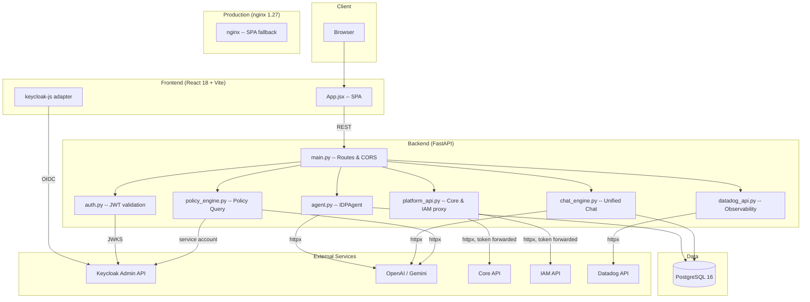

# kf-talentsuite-platform-agent

> Agentic AI system for managing your Talent Suite Platform -- Keycloak IDP lifecycle, client and user management, policy intelligence, certificate operations, and observability -- via a conversational React UI backed by FastAPI and multi-LLM orchestration.

**Generated:** 2026-04-12 by kf-readme | **Branch:** feat/rbac-phase1-admin-readonly

---

## Stack Overview

| Category | Technology |
|----------|-----------|
| Languages | Python 3.12, JavaScript (ES Modules) |
| Frontend | React 18.3, Vite 5.4 |
| Backend | FastAPI (uvicorn) |
| Databases | PostgreSQL 16 (psycopg2, yuniql migrations) |
| Cache / Queue | None detected |
| Search | None detected |
| Middleware | None detected |
| Auth | Keycloak (python-jose RS256 JWT + keycloak-js adapter) |
| Cloud Platform | AWS (Secrets Manager, OpenShift deploy) |
| CI/CD | GitHub Actions (7 workflows, reuses HayGroup/kfone-common) |
| Containerization | Docker (multi-stage), OpenShift (via kfone-common deploy) |
| Monitoring | Datadog (logs, traces, metrics, monitors, events -- optional) |
| LLM Providers | OpenAI gpt-4o, Google Gemini gemini-2.0-flash (httpx, no SDK) |
| Package Manager | pip (backend), npm (frontend) |
| Node Version | 20.x |
| Python Version | 3.12 |

---

## Architecture



---

## Korn Ferry Dependencies

No Korn Ferry internal packages (`@kf/*`, `@kornferry/*`) detected in dependencies.

Cross-repo coupling is through **CI/CD reusable workflows** from `HayGroup/kfone-common`:

| Workflow | Version | Purpose |
|----------|---------|---------|
| `docker-build-push` | 0.0.1 | Build & push Docker images to ECR |
| `create-build-tag` | 0.0.1 | Tag builds for release tracking |
| `workflow-env-setup` | 0.0.1 | Load environment-specific variables |
| `docker-api-deploy-openshift` | 0.0.1 | Deploy to OpenShift clusters |
| `create-deployment-tag` | 0.0.1 | Tag deployments for audit |

---

## Database Schema

```dbml
// idp_agent schema -- PostgreSQL 16

Table llm_usage_logs {
  id serial [pk, increment]
  operation varchar(100)
  llm_provider varchar(50)
  model varchar(100)
  prompt_tokens int
  completion_tokens int
  total_tokens int
  estimated_cost_usd numeric(10,6)
  duration_ms int
  success boolean
  created_at timestamptz [default: `now()`]
  created_by varchar(200) [default: 'system']
  updated_at timestamptz [default: `now()`]
  updated_by varchar(200) [default: 'system']

  indexes {
    created_at [name: 'idx_llm_usage_created']
    operation [name: 'idx_llm_usage_operation']
  }
}

Table chat_history {
  id serial [pk, increment]
  session_id varchar(200) [not null]
  user_sub varchar(200) [not null]
  user_email varchar(200) [default: '']
  role varchar(20) [not null]
  message text [not null]
  created_at timestamptz [default: `now()`]

  indexes {
    (user_sub, created_at) [name: 'idx_chat_user']
    session_id [name: 'idx_chat_session']
  }
}
```

Migrations managed by [yuniql](https://yuniql.io/) under `yuniql/scripts/`.

---

## Cloud Services

| Service | Usage |
|---------|-------|
| AWS Secrets Manager | DB credentials per environment (`/apps/idp-agent/{env}/db-credentials`) |
| AWS ECR | Docker image registry (`kfone-idp-agent/api`, `kfone-idp-agent/ui`) |
| OpenShift | Container orchestration (deploy via kfone-common workflows) |
| Datadog | Logs, traces, metrics, monitors, events (optional, API key-gated) |
| Keycloak | SSO, RBAC, service account API (external, self-hosted) |

---

## Critical Dependency Health

### Backend (Python -- no version pins in requirements.txt, installed = latest)

| Package | Installed | Latest | Status |
|---------|-----------|--------|--------|
| fastapi | 0.135.3 | 0.135.3 | 🟢 Current |
| uvicorn | 0.44.0 | 0.44.0 | 🟢 Current |
| httpx | 0.28.1 | 0.28.1 | 🟢 Current |
| pydantic | 2.12.5 | 2.12.5 | 🟢 Current |
| python-jose | 3.5.0 | 3.5.0 | 🟢 Current |
| psycopg2-binary | 2.9.11 | 2.9.11 | 🟢 Current |
| apscheduler | 3.11.2 | 3.11.2 | 🟢 Current |
| python-dotenv | 1.2.2 | 1.2.2 | 🟢 Current |
| cryptography | 46.0.7 | 46.0.7 | 🟢 Current |

### Frontend (npm)

| Package | Current | Latest | Status |
|---------|---------|--------|--------|
| react | ^18.3.0 | 19.2.5 | 🔴 Major behind |
| react-dom | ^18.3.0 | 19.2.5 | 🔴 Major behind |
| vite | ^5.4.0 | 8.0.8 | 🔴 Major behind |
| @vitejs/plugin-react | ^4.3.0 | 6.0.1 | 🔴 Major behind |

> Legend: 🟢 Current -- 🟡 Minor/patch behind -- 🔴 Major version behind -- ⚫ Deprecated/EOL

---

## Project Structure

```
kf-talentsuite-platform-agent/
├── backend/                    # FastAPI application
│   ├── main.py                 # Routes, request models, app bootstrap
│   ├── agent.py                # IDPAgent -- LLM orchestration
│   ├── chat_engine.py          # Unified multi-service chat engine
│   ├── policy_engine.py        # Natural-language policy query engine
│   ├── platform_api.py         # Core API & IAM API async client
│   ├── datadog_api.py          # Datadog observability client
│   ├── auth.py                 # Keycloak JWT validation (JWKS)
│   ├── keycloak_admin.py       # Service account auth + context builder
│   ├── skill.py                # IDP schema, validation rules, system prompt
│   ├── tools.py                # DB helpers, cert scanning, usage logging
│   ├── requirements.txt        # Python dependencies (unpinned)
│   ├── Dockerfile              # python:3.12-slim, uvicorn
│   └── variables/              # Per-environment deploy configs
├── frontend/                   # React SPA
│   ├── App.jsx                 # Single-file UI (all views)
│   ├── main.jsx                # React entry point
│   ├── index.html              # HTML shell
│   ├── keycloak.js             # Keycloak JS adapter config
│   ├── vite.config.js          # Vite dev/build config
│   ├── nginx.conf              # Production SPA serving
│   ├── package.json            # npm dependencies
│   ├── Dockerfile              # node:20 build -> nginx:1.27 serve
│   └── variables/              # Per-environment deploy configs
├── yuniql/                     # Database migrations
│   └── scripts/v0.00/          # Initial schema (idp_agent)
├── .github/workflows/          # CI/CD pipelines (7 workflows)
├── docker-compose.yml          # Local dev: postgres + backend + frontend
├── .env.example                # Environment variable reference
├── CLAUDE.md                   # Claude Code project instructions
└── README.md                   # Project documentation
```

---

## Environment & Config

| Variable | Purpose | Source |
|----------|---------|-------|
| `OPENAI_API_KEY` | OpenAI API credentials | .env |
| `GEMINI_API_KEY` | Google Gemini API credentials | .env |
| `DEFAULT_LLM_PROVIDER` | LLM provider selection (openai / gemini) | .env |
| `DAILY_QUERY_LIMIT` | Per-user daily query cap (0 = unlimited) | .env |
| `DB_HOST` / `DB_PORT` / `DB_NAME` / `DB_USER` / `DB_PASSWORD` | PostgreSQL connection | .env / AWS Secrets Manager |
| `IAM_SERVICE_BASE_URL` | Keycloak Admin REST API base URL | .env |
| `CORE_API_BASE_URL` | Core API proxy target | .env |
| `CORE_API_BEARER_TOKEN` | Service-to-service auth for scheduled jobs | .env |
| `IAM_API_BASE_URL` | IAM API proxy target | .env |
| `KEYCLOAK_ENABLED` | Enable/disable JWT validation (false for local dev) | .env |
| `KEYCLOAK_URL` / `KEYCLOAK_REALM` / `KEYCLOAK_CLIENT_ID` | SSO configuration | .env |
| `KEYCLOAK_ADMIN_CLIENT_ID` / `KEYCLOAK_ADMIN_CLIENT_SECRET` | Service account for policy queries | .env |
| `DATADOG_API_KEY` / `DATADOG_APP_KEY` / `DATADOG_SITE` | Datadog observability (omit to disable) | .env |
| `VITE_API_URL` | Backend URL for frontend | .env / build arg |
| `VITE_KEYCLOAK_ENABLED` / `VITE_KEYCLOAK_URL` / `VITE_KEYCLOAK_REALM` / `VITE_KEYCLOAK_CLIENT` | Frontend SSO config | .env / build arg |

---

## Scripts & Entry Points

### Backend

| Command | Purpose |
|---------|---------|
| `cd backend && python main.py` | Start FastAPI dev server (port 8000, auto-reload) |
| `cd backend && pytest --cov=. -v` | Run tests with coverage |
| `ruff check backend/` | Lint Python code |

### Frontend

| Script | Command | Purpose |
|--------|---------|---------|
| dev | `cd frontend && npm run dev` | Vite dev server (port 5173) |
| build | `cd frontend && npm run build` | Production build |
| preview | `cd frontend && npm run preview` | Preview production build locally |

### Infrastructure

| Command | Purpose |
|---------|---------|
| `docker compose up --build` | Start all services (postgres + backend + frontend) |
| `yuniql run` | Apply database migrations |

---

<sub>Generated by [kf-readme](https://github.com/user/developer-ai-skills/tree/main/skills/kf-readme) on 2026-04-12</sub>
